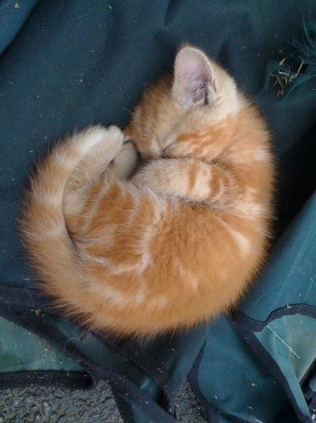
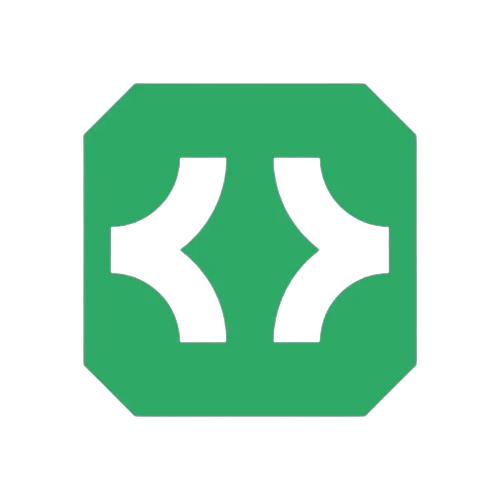

# Welcome to My GitHub Profile

  

  

  <strong>mvaq</strong>
  
  
  

## About Me

I am a developer passionate about open-source technologies and tools. I enjoy working with a variety of programming languages and platforms.

## My Projects

- **Velo Network**: Velo Network is the best PvP Practive server of 2024.

## Contact

- [LinkedIn](https://linkedin.com/in/your-profile)
- [Twitter](https://twitter.com/your-profile)
- [Email](mailto:matt@velo.llc)

Thanks for visiting my profile!

<!--
**mikethemn/mikethemn** is a ✨ _special_ ✨ repository because its `README.md` (this file) appears on your GitHub profile.

Here are some ideas to get you started:

- 🔭 I’m currently working on ...
- 🌱 I’m currently learning ...
- 👯 I’m looking to collaborate on ...
- 🤔 I’m looking for help with ...
- 💬 Ask me about ...
- 📫 How to reach me: ...
- 😄 Pronouns: ...
- ⚡ Fun fact: ...
-->
